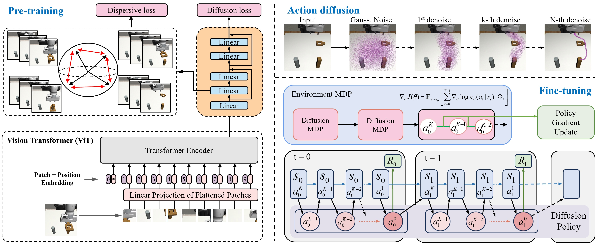

# D²PPO: Diffusion Policy Policy Optimization with Dispersive Loss

<div align="center">

[](https://guowei-zou.github.io/d2ppo/)
[](https://arxiv.org/abs/2508.02644)
[](https://github.com/Guowei-Zou/d2ppo-release.git)
[](https://youtu.be/a4nR4IXNwQE)
[](https://www.bilibili.com/video/BV1mqtFzNEnu/?share_source=copy_web&vd_source=af323cc810d69452bd73799b93e838d6)
</div>

> **D²PPO: Diffusion Policy Policy Optimization with Dispersive Loss**
> 
> An enhanced version of Diffusion Policy Policy Optimization with dispersive loss regularization for improved representation learning and policy robustness in continuous control and robot learning tasks.

## 🏗️ Model Architecture

<div align="center">


*D²PPO framework overview: The model consists of pre-training with dispersive loss regularization (left) and fine-tuning with PPO (right). The dispersive loss prevents representation collapse in diffusion networks, while the Vision Transformer (ViT) processes visual inputs for robotic manipulation tasks.*
</div>

## 🎯 Key Innovation: Dispersive Loss

**D²PPO addresses diffusion representation collapse**, a fundamental challenge where diffusion policy networks learn redundant or collapsed representations. Our **Dispersive Loss** regularization technique enhances diffusion-based policy learning by:

- **🔧 Preventing representation collapse**: Maintains feature diversity in diffusion policy networks
- **📈 Improved sample efficiency**: 22.7% improvement in pre-training, 26.1% after fine-tuning
- **🎯 Enhanced policy performance**: Achieves 94% average success rate on manipulation tasks
- **🤖 Vision-based robotics**: Validated on Robomimic benchmark and real Franka Emika Panda robot

### How Dispersive Loss Works

Dispersive Loss adds a regularization term to the standard diffusion policy training objective to address representation collapse:

```
L_total = L_diffusion + <LAMBDA> * L_dispersive
```

Where `L_dispersive` uses contrastive learning principles with three variants:
- **InfoNCE-L2**: InfoNCE loss with L2 distance (best overall performance)
- **InfoNCE-Cosine**: InfoNCE loss with cosine similarity
- **Hinge Loss**: Margin-based separation for feature diversity

## 🚀 Quick Start

### Installation

1. **Clone and setup environment**:
```bash
git clone https://github.com/your-username/d2ppo.git  # TODO: Replace with your actual repository URL
cd d2ppo
conda create -n d2ppo python=3.8 -y
conda activate d2ppo
pip install -e .
```

2. **Install Python environment dependencies**:
```bash
# For robotic manipulation tasks (primary focus)
pip install -e .[robomimic]

# Or install all environments
pip install -e .[all]  # includes gym, robomimic, d3il, furniture
```

3. **Install external dependencies** (choose based on your environments):
```bash
# For Gym and Robomimic environments: Install MuJoCo
# See installation/install_mujoco.md for detailed instructions

# For D3IL environments: Install D3IL
# See installation/install_d3il.md for detailed instructions

# For Furniture-Bench environments: Install IsaacGym and Furniture-Bench
# See installation/install_furniture.md for detailed instructions
```

4. **Setup environment variables**:
```bash
source script/set_path.sh  # Sets data and logging directories, WandB entity
```

### Dataset Download

**Note**: For fair comparison with the original DPPO algorithm, we use the same datasets as provided in the DPPO paper.

Pre-training data for all tasks are pre-processed and available at [Google Drive](https://drive.google.com/drive/folders/1AXZvNQEKOrp0_jk1VLepKh_oHCg_9e3r?usp=drive_link). The pre-training script will download the data (including normalization statistics) automatically to the data directory.

Pre-trained policies used in the paper can be found at [Google Drive](https://drive.google.com/drive/folders/1aNsu_TzotSxwpSWP5GmBYy8tVO8w2eDv?usp=drive_link). Fine-tuning script will download the default checkpoint automatically to the logging directory.

### Run with Dispersive Loss

**Pre-training with Dispersive Loss** (Recommended):
```bash
# Robomimic tasks with dispersive loss enhancement (Image-based) - Replace <TASK_NAME> with specific task
python script/run.py --config-name=pre_diffusion_mlp_dispersive_img --config-dir=cfg/robomimic/pretrain/<TASK_NAME>  # Available tasks: lift, can, square, transport

# Other environments - Replace <TASK_NAME> with specific task
python script/run.py --config-name=pre_diffusion_mlp_dispersive --config-dir=cfg/gym/pretrain/<TASK_NAME>  # e.g., hopper-medium-v2, walker2d-medium-v2, halfcheetah-medium-v2
python script/run.py --config-name=pre_diffusion_mlp_dispersive --config-dir=cfg/d3il/pretrain/<TASK_NAME>  # e.g., avoid_m1, avoid_m2, avoid_m3
python script/run.py --config-name=pre_diffusion_mlp_dispersive --config-dir=cfg/furniture/pretrain/<TASK_NAME>  # e.g., one_leg_low, lamp_med, round_table_low
```

**Standard D²PPO Fine-tuning**:
```bash
# Fine-tune the dispersive loss enhanced policy (Image-based for robomimic) - Replace <TASK_NAME> with specific task
python script/run.py --config-name=ft_ppo_diffusion_mlp_img --config-dir=cfg/robomimic/finetune/<TASK_NAME>  # Available tasks: lift, can, square, transport

# Fine-tune other environments (state-based) - Replace <TASK_NAME> with specific task
python script/run.py --config-name=ft_ppo_diffusion_mlp --config-dir=cfg/gym/finetune/<TASK_NAME>  # e.g., hopper-v2, walker2d-v2, halfcheetah-v2
python script/run.py --config-name=ft_ppo_diffusion_mlp --config-dir=cfg/furniture/finetune/<TASK_NAME>  # e.g., one_leg_low, lamp_med, round_table_low
```

## 📊 Dispersive Loss Configuration

### Key Parameters

Add these parameters to your model configuration to enable dispersive loss:

```yaml
model:
  # Enable dispersive loss
  use_dispersive_loss: true
  
  # Regularization strength (recommended: 0.1-1.0)
  dispersive_loss_weight: <LAMBDA>  # e.g., 0.5
  
  # Temperature parameter for contrastive loss (recommended: 0.1-1.0)
  dispersive_loss_temperature: <TEMPERATURE>  # e.g., 0.5
  
  # Loss variant (recommended: "infonce_l2")
  dispersive_loss_type: "<LOSS_TYPE>"  # Options: infonce_l2, infonce_cosine, hinge, covariance
  
  # Target network layer (recommended: "mid")
  dispersive_loss_layer: "<LAYER>"  # Options: early, mid, late, all
```

### Available Loss Types

**Three dispersive loss variants** addressing different aspects of representation collapse:

1. **`infonce_l2`** (Recommended): InfoNCE loss with L2 distance - optimal for most tasks
2. **`infonce_cosine`**: InfoNCE loss with cosine similarity - better for high-dimensional features
3. **`hinge`**: Hinge loss for margin-based separation - more stable training dynamics

### Layer Targeting Strategy

**Task-dependent layer selection** for optimal performance:

- **`early`**: Early network layers (1/4 position) - **Best for simple tasks**
- **`mid`**: Middle layers (1/2 position) - **Balanced approach**  
- **`late`**: Late layers (3/4 position) - **Best for complex tasks**
- **`all`**: Average across all applicable layers - **Most stable**

> **Research Finding**: Task complexity correlates with optimal layer selection. Simple manipulation tasks benefit from early-layer regularization, while complex multi-step tasks perform better with late-layer dispersive loss.

## 🎮 Supported Environments

### Primary Focus: Robomimic Manipulation Tasks (Image-based)

> **Important**: All Robomimic tasks use **image-based** configurations (`*_img`) for vision-based manipulation with RGB camera observations.

**Comprehensive evaluation on Robomimic benchmark:**

| Task | Description | Dispersive Config | Standard Config |
|------|-------------|-------------------|-----------------|
| **Lift** | Object lifting task | `pre_diffusion_mlp_dispersive_img` | `pre_diffusion_mlp_img` |
| **Can** | Pick and place manipulation | `pre_diffusion_mlp_dispersive_img` | `pre_diffusion_mlp_img` |
| **Square** | Precision manipulation | `pre_diffusion_mlp_dispersive_img` | `pre_diffusion_mlp_img` |
| **Transport** | Dual-arm coordination | `pre_diffusion_mlp_dispersive_img` | `pre_diffusion_mlp_img` |

**Real Robot Validation**: Successfully deployed on **Franka Emika Panda** 7-DOF manipulator, demonstrating practical effectiveness in real-world scenarios.

### Additional Environments

- **Gym**: MuJoCo locomotion tasks (hopper, walker2d, halfcheetah)
- **D3IL**: Industrial manipulation benchmark  
- **Furniture-Bench**: Complex assembly tasks (lamp, one_leg, round_table)

## 📈 Performance Benefits

Based on extensive evaluation on Robomimic benchmark tasks:

- **🎯 22.7% improvement** in sample efficiency during pre-training phase
- **📊 26.1% improvement** after PPO fine-tuning phase  
- **🏆 94% average success rate** across manipulation tasks (Lift, Can, Square, Transport)
- **🔄 More stable training** with reduced variance and faster convergence
- **🤖 Real robot validation** on Franka Emika Panda demonstrating practical effectiveness


## 📁 Project Structure

```
d2ppo/
├── model/
│   ├── diffusion/
│   │   ├── diffusion.py          # Core diffusion + dispersive loss
│   │   ├── mlp_diffusion.py      # Network with hooks
│   │   └── diffusion_ppo.py      # PPO integration
│   └── common/
│       └── dispersive_loss.py    # Loss implementations
├── cfg/
│   └── robomimic/
│       ├── pretrain/             # Dispersive loss configs
│       └── finetune/             # Standard fine-tuning configs
├── agent/
│   ├── pretrain/                 # Pre-training agents
│   └── finetune/                 # Fine-tuning agents
└── script/
    └── run.py                    # Main training script
```

## 🔬 Research

This work is available as a preprint on OpenReview. If you use D²PPO with dispersive loss in your research, please cite:


### Key Research Contributions

- **Novel Problem Identification**: First work to identify and address "diffusion representation collapse" in policy learning
- **Principled Solution**: Three dispersive loss variants with theoretical foundation
- **Comprehensive Evaluation**: Extensive validation on Robomimic benchmark (4 tasks) and real robot experiments
- **Practical Impact**: 22.7% pre-training improvement, 26.1% fine-tuning improvement, achieving 94% average success rate


## ⭐ Acknowledgments

Built upon the excellent [DPPO codebase](https://github.com/irom-lab/dppo) by Ren et al., enhanced with dispersive loss innovations.

Core dependencies:
- **[Diffuser](https://github.com/jannerm/diffuser)**: Diffusion model foundation
- **[Robomimic](https://github.com/ARISE-Initiative/robomimic)**: Manipulation benchmarks
- **[CleanRL](https://github.com/vwxyzjn/cleanrl)**: PPO implementation

## 📄 License

This project is released under the MIT License. See [LICENSE](LICENSE) for details.

---

🔬 **Research Focus**: This implementation primarily targets **vision-based robotic manipulation tasks** where dispersive loss shows the most significant improvements. The technique is particularly effective for **image-based policies** using RGB camera observations in complex manipulation scenarios.

## 📖 Citation

If you use D²PPO in your research, please cite:

```bibtex
@misc{zou2025d2ppodiffusionpolicypolicy,
      title={D2PPO: Diffusion Policy Policy Optimization with Dispersive Loss}, 
      author={Guowei Zou and Weibing Li and Hejun Wu and Yukun Qian and Yuhang Wang and Haitao Wang},
      year={2025},
      eprint={2508.02644},
      archivePrefix={arXiv},
      primaryClass={cs.AI},
      url={https://arxiv.org/abs/2508.02644}, 
}
```

## ⭐ Star History

<div align="center">

[](https://star-history.com/#Guowei-Zou/d2ppo-release&Date)

</div>